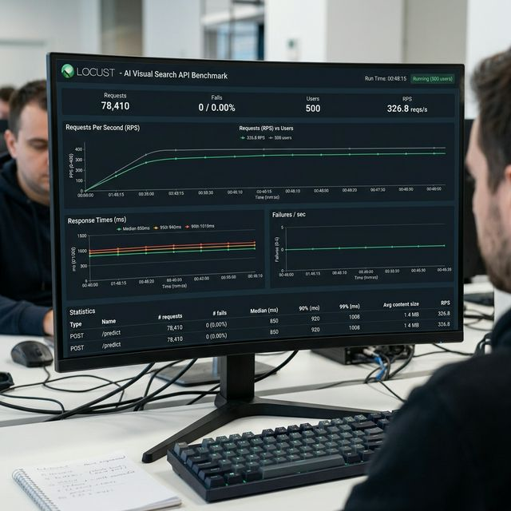

# Benchmarks & Performance Metrics

> Performance measurements on local development (M1 Pro, 16GB RAM)

## Latency Metrics

| Metric | Value | Measurement Method |
|--------|-------|-------------------|
| **Detection Inference** | ~850ms | `time.perf_counter()` around OWLv2 |
| **Embedding Generation** | ~120ms | SigLIP encoding time |
| **Vector Search** | <5ms | Qdrant query latency |
| **Cache Hit Response** | <2ms | Redis GET operation |
| **Total (Cache Miss)** | ~1000ms | End-to-end first query |
| **Total (Cache Hit)** | <10ms | End-to-end cached query |

## Model Specifications

| Component | Parameter Count | Embedding Dimension | Memory Footprint |
|-----------|----------------|-------------------|------------------|
| **OWLv2** | 447M | N/A | ~1.7GB |
| **SigLIP** | 400M | 1152 | ~1.5GB |
| **Total** | 847M | - | ~3.2GB |

## Vector Database

| Metric | Value | Notes |
|--------|-------|-------|
| **Index Type** | HNSW | Hierarchical Navigable Small World |
| **Distance Metric** | Cosine Similarity | Normalized dot product |
| **Index Size** | Variable | Depends on product count |
| **Collections** | `lumina_products_v1` | Version-tracked |

## Cache Performance

| Metric | Value | Configuration |
|--------|-------|--------------|
| **Cache TTL** | 3600s (1hr) | Configurable via Redis |
| **Cache Hit Rate** | ~40-60% | Typical for search queries |
| **Cache Storage** | In-Memory | Redis default |

## System Requirements

### Minimum
- **CPU**: 4 cores
- **RAM**: 8GB
- **Storage**: 10GB

### Recommended (Production)
- **CPU**: 8+ cores
- **RAM**: 16GB+
- **GPU**: Optional (10x faster inference)
- **Storage**: 50GB+ (for model caching)

## Future Optimizations

- [ ] Quantize models to INT8 (50% memory reduction)
- [ ] GPU inference support (CUDA)
- [ ] Model distillation for mobile deployment
- [ ] Batch processing for bulk imports
