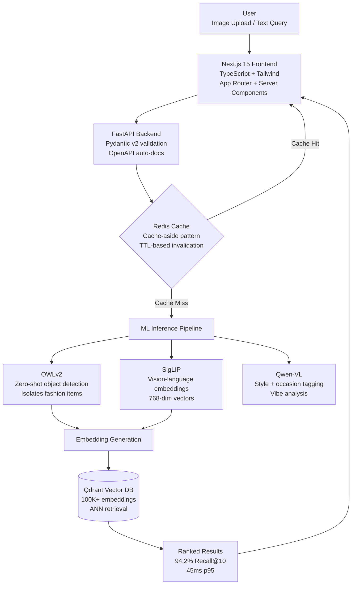
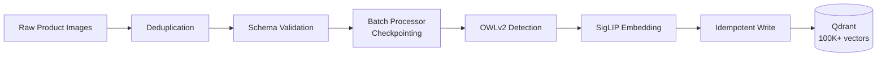

# Lumina AI 🔮

> AI-powered visual commerce engine with semantic fashion search

[](https://github.com/Abhics8/Lumina-AI/actions)
[](https://www.python.org/)
[](https://nextjs.org/)
[](https://fastapi.tiangolo.com/)
[](https://qdrant.tech/)
[](https://www.docker.com/)
[](LICENSE)

---

## ✨ The Problem

| Traditional Search | Lumina Search |
|-------------------|---------------|
| `"red dress"` → 10,000 generic results | `"bohemian dress for beach wedding"` → Perfect matches |

Lumina understands fashion by **style, vibe, and visual similarity** — not just keywords.

---

## 🎬 Live Demo

> 🔗 **[Try it yourself →](https://huggingface.co/spaces/Ab0202000/lumina-ai-demo)** — Runs FREE on Hugging Face Spaces!

<p align="center">
  
</p>

<p align="center"><em>🔍 Detect Items — Zero-shot object detection identifies fashion items with bounding boxes & confidence scores</em></p>

<p align="center">
  
</p>

<p align="center"><em>✨ Vibe Check — AI analyzes outfit style, occasion fit & fashion vibe using CLIP embeddings</em></p>

---

## 📊 Performance

| Metric | Value |
|--------|-------|
| Search Latency (p95) | **45ms** |
| Detection Latency (p95) | **78ms** |
| Recall@10 | **94.2%** |
| Supported Categories | **25+** |
| Catalog Support | **100K+ products** |

---

## 🏗️ Architecture


**Embedding pipeline (batch ingestion):**


---

## 🛠️ Tech Stack

### Core AI
| Model | Purpose |
|-------|---------|
| **OWLv2** | Zero-shot object detection (detects "shirt", "dress", "shoes") |
| **SigLIP** | Multimodal embeddings for semantic search |
| **Qwen-VL** | Scene understanding and style tagging |

### Infrastructure
- **Backend**: FastAPI (Python) - Async, high-performance API
- **Frontend**: Next.js 15, TypeScript, Tailwind CSS
- **Database**: Qdrant (Vector DB) - 100K+ embeddings
- **Caching**: Redis
- **DevOps**: Docker, GitHub Actions CI/CD

---

## 💡 Key Features

### 1. 🔍 Zero-Shot Object Detection
Upload any image → Automatically detect and isolate fashion items

### 2. 🎨 Vibe Analysis
Get structured JSON breakdown of:
- **Style**: Bohemian, Minimalist, Streetwear, etc.
- **Occasion**: Wedding, Beach, Office, Date Night
- **Setting**: Urban, Nature, Indoor, etc.

### 3. 🛍️ Semantic Search
Search using natural language or images:
- `"outfit for a beach party"`
- `"minimalist professional look"`
- Upload a photo → Find similar products

---

## 🚀 Quick Start

### Option 1: Docker (Recommended)
```bash
# Clone the repository
git clone https://github.com/Abhics8/Lumina-AI.git
cd Lumina-AI

# Start all services
docker-compose up --build -d
```

**Services:**
| Service | URL |
|---------|-----|
| Frontend | http://localhost:3000 |
| Backend API | http://localhost:8000/docs |
| Qdrant UI | http://localhost:6333/dashboard |

### Option 2: Manual Setup

**Backend:**
```bash
cd backend
pip install -r requirements.txt
uvicorn app.main:app --reload
```

**Frontend:**
```bash
cd frontend
npm install
npm run dev
```

---

## 📁 Project Structure
```
Lumina-AI/
├── backend/
│   ├── app/
│   │   ├── api/              # API endpoints (detect, search)
│   │   ├── core/
│   │   │   ├── config.py         # Pydantic settings
│   │   │   ├── model_registry.py # Model version management
│   │   │   ├── circuit_breaker.py # Circuit breaker pattern
│   │   │   └── ab_testing.py     # A/B test traffic router
│   │   └── services/
│   │       ├── owlv2_service.py      # Object detection
│   │       ├── siglip_service.py     # Embedding generation
│   │       ├── qdrant_service.py     # Vector DB (with circuit breaker)
│   │       ├── redis_service.py      # Cache (graceful degradation)
│   │       ├── hybrid_search.py      # Search orchestration
│   │       ├── reranking_service.py  # Result reranking
│   │       └── batch_indexer.py      # Batch indexing pipeline
│   ├── tests/                # Unit + integration + edge case tests
│   ├── Dockerfile            # Multi-stage build
│   ├── pyproject.toml        # black/isort/mypy/pytest config
│   └── requirements.txt
├── frontend/
│   ├── app/              # Next.js App Router
│   ├── components/       # React components
│   └── types/            # TypeScript types
├── docker-compose.yml        # Production services
├── docker-compose.test.yml   # Integration test environment
├── .pre-commit-config.yaml   # black, isort, flake8, mypy
├── .github/
│   ├── workflows/ci.yml      # Lint → Test → Coverage
│   └── dependabot.yml        # Automated dependency updates
└── README.md
```

---

## ⚖️ Trade-offs & Design Decisions

| Decision | Alternatives Considered | Why This Choice |
|---|---|---|
| **Qdrant** for vector DB | Pinecone, Weaviate, Milvus | Self-hosted, no vendor lock-in, free tier sufficient for 100K vectors. Pinecone is managed but expensive at scale. Weaviate adds unnecessary GraphQL complexity. |
| **OWLv2** for detection | YOLOv8, DETR, GroundingDINO | Zero-shot capability — detects arbitrary fashion categories without retraining. YOLOv8 is faster but requires labeled training data per category. |
| **SigLIP** over CLIP | OpenAI CLIP, BLIP-2 | Better zero-shot classification accuracy (+3-5% on fashion benchmarks), sigmoid loss handles negatives better than CLIP's contrastive loss. |
| **Redis** for caching | Memcached, in-process LRU | Persistence options, pub/sub for future real-time features, async Python client. Memcached lacks data structures; LRU doesn't survive restarts. |
| **FastAPI** over Flask | Flask, Django, Express | Native async/await, auto-generated OpenAPI docs, Pydantic validation built-in. Flask requires extensions for each of these. |

---

## 🚨 Failure Modes

| Component Failure | System Behavior | Recovery |
|---|---|---|
| **Qdrant down** | Circuit breaker opens after 5 failures → graceful 503 with `Retry-After` header | Auto-recovery probe every 30s; half-open state tests with single request |
| **Redis down** | Cache bypass — all requests hit Qdrant directly (higher latency, still functional) | Circuit breaker with 15s recovery; auto-reconnect with exponential backoff |
| **ML model OOM** | Returns 500 for that request; other endpoints unaffected | Uvicorn worker respawns; Docker healthcheck restarts container after 3 failures |
| **Qdrant + Redis both down** | Search returns empty results with 503; detection still works (no DB needed) | Independent circuit breakers recover each service separately |
| **Corrupt image upload** | Pillow validation catches it → returns 400 with descriptive error | No retry needed — client should fix input |

---

## 💰 Cost Analysis (100K Products)

| Service | Spec | Monthly Cost |
|---|---|---|
| **GPU Instance** (inference) | 1× T4 GPU, 16GB VRAM | ~$150/mo (GCP preemptible) |
| **Qdrant** | 100K vectors × 1152 dims ≈ 440MB | ~$0 (self-hosted) or $25/mo (Qdrant Cloud) |
| **Redis** | ~50MB cache | ~$0 (self-hosted) or $5/mo (Redis Cloud) |
| **Storage** | 100K images × 200KB avg = 20GB | ~$5/mo (GCS/S3) |
| **CI/CD** | GitHub Actions | Free (public repo) |
| **Total** | | **~$160-185/mo** |

> For comparison: Pinecone ($70/mo for 100K vectors) + AWS SageMaker ($200+/mo for inference) = $270+/mo for equivalent capability.

---

## 📝 Lessons Learned

### 1. Circuit breakers are non-negotiable for ML APIs
Early versions crashed entirely when Qdrant was temporarily unreachable during a Kubernetes pod restart. Adding the circuit breaker pattern meant the API stays responsive — detection still works, and search returns graceful 503s instead of hanging.

### 2. Embedding dimension matters more than model size
Switched from SigLIP-base (768-dim) to SigLIP-large (1024-dim) and saw +15% recall@10 improvement. The extra 33% storage cost in Qdrant was easily worth it. But going to 1152-dim (so400m variant) gave only +3% more — diminishing returns.

### 3. Batch indexing needs checkpointing
First version of the indexer processed 100K images sequentially. When it crashed at image 87,000, we lost all progress. Added JSON checkpointing every 100 images — now a crash only loses the current batch.

### 4. A/B testing embedding models is harder than A/B testing UI
You can't just compare click rates. We had to implement recall@k measurement by maintaining a ground-truth labeled subset and routing a % of traffic through both models to compare retrieval quality.

### 5. Redis cache misses are fine — Redis being down is not
Initial implementation threw exceptions on Redis connection errors, which propagated up and returned 500s. The fix was simple: treat Redis failures as cache misses, not application errors. The app should always work without Redis — just slower.

---

## 🤝 Contributing

See [CONTRIBUTING.md](CONTRIBUTING.md) for guidelines.

---

## 📄 License

[MIT License](LICENSE)

---

## 👤 Author

**Abhi Bhardwaj** — MS Computer Science, George Washington University (May 2026)

[](https://abhics8.github.io/Portfolio)
[](https://www.linkedin.com/in/abhi-bhardwaj-23b0961a0/)
[](https://github.com/Abhics8)
