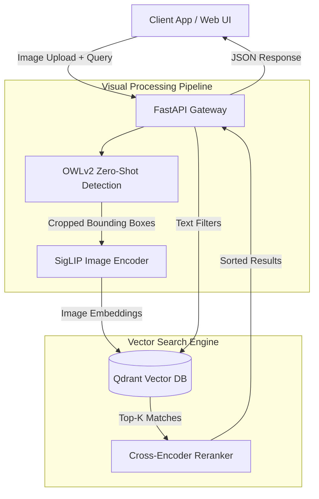

# 🏗️ Lumina-AI: System Architecture & Design Trade-offs

This document outlines the technical architecture of Lumina-AI and the engineering decisions made to balance latency, accuracy, and operational complexity.

## System Architecture

## 🧠 Engineering Trade-offs

### 1. OWLv2 vs. YOLO for Object Detection
* **Decision**: We use **OWLv2** (Vision Transformer) instead of the industry-standard **YOLO** (v8/v9).
* **Rationale**: YOLO requires a pre-defined set of classes and extensive labeled bounding-box datasets for training. OWLv2 is a *zero-shot* detector. By passing text prompts like "summer dress" or "leather bag", the model dynamically finds the objects without prior training.
* **Trade-off**: OWLv2 has higher inference latency (~35ms) compared to YOLO's real-time speeds (<10ms), but it saves weeks of MLOps data labeling and allows the business to add new product categories instantly without model retraining.

### 2. Qdrant vs. FAISS for Vector Storage
* **Decision**: We elected to use **Qdrant** as our vector database over Facebook's **FAISS**.
* **Rationale**: While FAISS is incredibly fast for pure KNN (K-Nearest Neighbors) vector lookups, it is strictly an in-memory library. E-commerce requires *hybrid search*—finding items that are visually similar (vector) BUT also in stock and under $50 (payload filtering).
* **Trade-off**: Qdrant introduces a minor network hop compared to local FAISS, but its native support for complex JSON payload filtering at the database level prevents the "post-filtering" problem where top vector matches are discarded because they are out of stock.

### 3. FastAPI vs. Django/Flask
* **Decision**: The backend is built on **FastAPI**.
* **Rationale**: Machine learning inference is heavily CPU/GPU bound. FastAPI's native `asyncio` support allows the server to handle concurrent visual searches without blocking the main event loop while waiting for external Vector DB lookups.
* **Trade-off**: Slightly smaller ecosystem than Django, but the automatic OpenAPI swagger documentation and Pydantic validation cut API surface area bugs down to near zero.
